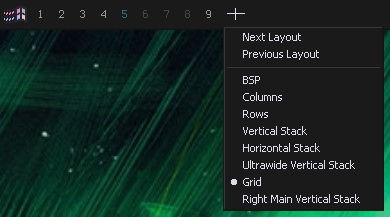

# komoband
Simplistic workspace switcher deskband for [komorebi](https://github.com/LGUG2Z/komorebi)




## Install

### Automatic
TODO

### Manual
Requires git (can be suplemented for Download ZIP), and [.NET SDK](https://download.visualstudio.microsoft.com/download/pr/d1adccfa-62de-4306-9410-178eafb4eeeb/48e3746867707de33ef01036f6afc2c6/dotnet-sdk-8.0.303-win-x64.exe)

```
git clone https://github.com/Cynosphere/komoband.git
cd komoband
dotnet build src
```

If you have [Visual Studio Build Tools](https://aka.ms/vs/17/release/vs_BuildTools.exe) installed:

```
cd src/bin/x64/Debug/net472
"C:\Program Files (x86)\Microsoft Visual Studio\2022\BuildTools\VC\Auxiliary\Build\vcvars64.bat"
sudo regasm /codebase komoband.dll
```

Otherwise you can modify this registry file with the path to the komoband DLL and import it

<details>
	<summary>Registry file</summary>
<pre>
Windows Registry Editor Version 5.00

[HKEY_CLASSES_ROOT\CLSID\{6249307D-7F13-437B-BF13-13BE692C22A5}]
@="komoband"

[HKEY_CLASSES_ROOT\CLSID\{6249307D-7F13-437B-BF13-13BE692C22A5}\Implemented Categories]

[HKEY_CLASSES_ROOT\CLSID\{6249307D-7F13-437B-BF13-13BE692C22A5}\Implemented Categories\{00021492-0000-0000-c000-000000000046}]

[HKEY_CLASSES_ROOT\CLSID\{6249307D-7F13-437B-BF13-13BE692C22A5}\Implemented Categories\{62C8FE65-4EBB-45e7-B440-6E39B2CDBF29}]

[HKEY_CLASSES_ROOT\CLSID\{6249307D-7F13-437B-BF13-13BE692C22A5}\InprocServer32]
@="mscoree.dll"
"ThreadingModel"="Both"
"Class"="komoband.Deskband"
"Assembly"="komoband, Version=1.0.0.0, Culture=neutral, PublicKeyToken=null"
"RuntimeVersion"="v4.0.30319"
"CodeBase"="file:///C:/path/to/komoband/src/bin/x64/Debug/net472/komoband.DLL"

[HKEY_CLASSES_ROOT\CLSID\{6249307D-7F13-437B-BF13-13BE692C22A5}\InprocServer32\1.0.0.0]
"Class"="komoband.Deskband"
"Assembly"="komoband, Version=1.0.0.0, Culture=neutral, PublicKeyToken=null"
"RuntimeVersion"="v4.0.30319"
"CodeBase"="file:///C:/path/to/komoband/src/bin/x64/Debug/net472/komoband.DLL"

[HKEY_CLASSES_ROOT\CLSID\{6249307D-7F13-437B-BF13-13BE692C22A5}\ProgId]
@="komoband.Deskband"
</pre>
</details>

## Configuration
Right click the bar anywhere (except the layout switcher) and click "Configure".

Config file is located at `%appdata%/komoband/config.json`
